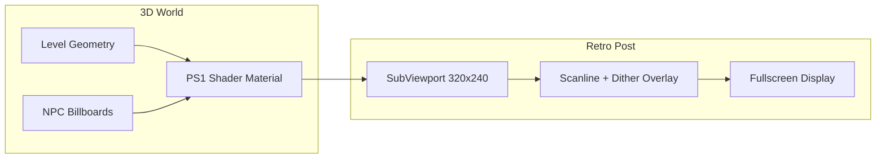
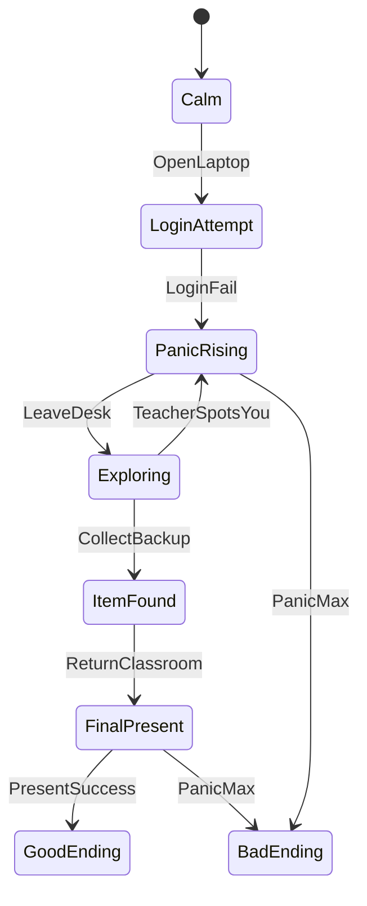

# 동훈 패닉 — Godot 4 PS1 스타일 스팀 분량 게임

## 컨셉

**한 줄 요약:** 국어 발표 시간, Google Drive 자료가 로그인 문제로 안 열리면서 패닉에 빠진 학생 **동훈**이 학교 곳곳을 돌며 대안을 찾는 1인칭 코미디·서바이벌 게임.

**톤:** 발디의 수학(Baldi's Basics)처럼 기괴하고 코믹한 PS1 로우폴리 공포·코미디. 실제 사진([assets/student photo](C:/Users/GRAM/.cursor/projects/c-Users-GRAM-dhp-donghunpanic/assets/c__Users_GRAM_AppData_Roaming_Cursor_User_workspaceStorage_05b6a87e17d155b03df53dbb45eb0c89_images_image-4fc1c582-5daa-44c6-bf8d-6eb5485b39df.png))을 동훈 NPC/거울/UI 초상에 텍스처로 사용.

---

## 기술 스택

| 항목 | 선택 |
|------|------|
| 엔진 | **Godot 4.3+** (GDScript) |
| 카메라 | 1인칭 (발디 스타일) |
| 렌더 | 3D + 커스텀 PS1 셰이더 + SubViewport 저해상도(320×240) 업스케일 |
| 입력 | WASD, 마우스, E(상호작용), Shift(달리기), Esc(일시정지) |
| 한글 UI | `Noto Sans KR` 또는 `Gothic A1` TTF 임포트 |

현재 [README.md](c:/Users/GRAM/dhp/donghunpanic/README.md)만 있는 빈 저장소이므로 Godot 프로젝트 전체를 새로 스캐폴딩합니다.

---

## PS1 / 발디 비주얼 파이프라인



- **PS1 셰이더** (`shaders/ps1_snap.gdshader`): 버텍스 스냅(16~32단계), nearest 필터, 약한 아핀 텍스처 왜곡, 단순 버텍스 컬러 라이팅
- **SubViewport 렌더**: 실제 3D를 저해상도로 렌더 후 `texture_filter = nearest`로 4× 업스케일
- **환경**: 형광등 밝은 교실 천장(사진 참고), 단색 벽지, 반복 텍스처, 과장된 FOV(90~100°)
- **캐릭터**: Baldi식 **빌보드 스프라이트**(동훈·국어선생님·급식아줌마 등) + 로우폴리 바디 실루엣

---

## 게임 구조 (스팀 분량)

### 챕터 구성 (약 45~90분 1회 플레이)

| 챕터 | 장소 | 핵심 이벤트 |
|------|------|-------------|
| Prologue | 교실 | 발표 시작 → 노트북에서 Drive 열기 시도 |
| Ch.1 | 교실+복도 | Google 로그인 미니게임 실패, 패닉 게이지 상승, 탈출/탐색 시작 |
| Ch.2 | 컴퓨터실 | 다른 PC·캐시·USB 시도, IT 담당 교사 NPC |
| Ch.3 | 도서관 | 인쇄본·친구 노트 발견 루트 |
| Ch.4 | 교무실/교장실 | 선생님 계정·허가서 루트 (스텔스) |
| Ch.5 | 교실 복귀 | 최종 발표 이벤트 + 엔딩 분기 |

### 탐험 구역 (연결된 학교 맵)

- **2-A 교실** (시작/종료)
- **중앙 복도** (허브)
- **컴퓨터실**
- **도서관**
- **교무실**
- **급식실/매점** (회복 아이템)
- **운동장** (히든 엔딩 루트)

맵은 Godot `WorldEnvironment` + CSG/GridMap으로 프로토타입 후, 이후 Blender 로우폴리 교체 가능하게 레이어 분리.

### 핵심 시스템



1. **패닉 게이지** (`scripts/autoload/panic_manager.gd`): 0~100, 시간 경과·시선(동급생)·달리기·로그인 실패마다 상승; 급식실/물 마시면 소폭 감소
2. **Google 로그인 미니게임** (`scenes/ui/google_login.tscn`): 가짜 로그인 UI — CAPTCHA, 2FA, "세션이 만료되었습니다" 연속 팝업; 실패 시 패닉 +25
3. **NPC AI** (`scripts/npc/teacher_ai.gd`): 발디식 순찰 — 소리/시야 감지, 추적 시 패닉 급상승
4. **인벤토리/퀘스트** (`scripts/autoload/game_state.gd`): USB, 인쇄본, 친구 PPT 등 키 아이템 + 플래그 기반 스토리
5. **대화/자막** (`scenes/ui/dialogue_box.tscn`): 한국어 대사 JSON (`data/dialogue_ko.json`)
6. **세이브/로드** (`scripts/autoload/save_manager.gd`): 챕터 체크포인트 + 설정
7. **엔딩 5+종**: 완벽 발표 / 즉흥 발표 / 도주 / 교실 붕괴(게임오버) / 히든(운동장)

---

## 프로젝트 디렉터리 구조

```
donghunpanic/
├── project.godot
├── export_presets.cfg          # Windows/Linux Steam 빌드용
├── assets/
│   ├── characters/donghun_face.png   ← 제공 사진 복사
│   ├── textures/   (벽, 바닥, 천장 타일)
│   ├── audio/      (placeholder BGM/SFX)
│   └── fonts/NotoSansKR-Regular.ttf
├── data/
│   ├── dialogue_ko.json
│   ├── items.json
│   └── endings.json
├── scenes/
│   ├── main/main_menu.tscn
│   ├── main/game.tscn            # 루트: SubViewport + UI 레이어
│   ├── player/player.tscn
│   ├── levels/                   # classroom, hallway, lab, library...
│   ├── npc/                      # teacher, classmate, librarian
│   ├── props/laptop.tscn
│   └── ui/                       # HUD, login, dialogue, pause
├── scripts/
│   ├── autoload/                 # game_state, panic_manager, save_manager, audio_manager
│   ├── player/player_controller.gd
│   ├── npc/teacher_ai.gd
│   └── systems/interactable.gd
└── shaders/ps1_snap.gdshader
```

---

## 주요 씬·스크립트 (구현 우선순위)

### Phase 1 — 코어 플레이 가능 (MVP)
- `project.godot` + Autoload 4종
- PS1 렌더 파이프라인 (`scenes/main/game.tscn`)
- 1인칭 플레이어 (`player_controller.gd`: CharacterBody3D, head bob)
- **교실 + 복도** 프로토타입 레벨
- Google 로그인 UI + 패닉 HUD
- Prologue → Ch.1 플레이 가능

### Phase 2 — 스팀 분량 확장
- 나머지 5개 구역 + 구역 간 `Area3D` 포털
- NPC 3종 AI (국어선생님, 컴실교사, 교장)
- 아이템·퀘스트·대화 JSON 연동
- 5개 엔딩 + 엔딩 크레딧

### Phase 3 — 폴리시 & Steam 준비
- 메인 메뉴, 설정(해상도, 마우스 감도, 언어), 세이브 슬롯 3개
- BGM 3곡 + SFX (발표 Bell, 키보드, 심장박동, 발걸음)
- `export_presets.cfg` Windows Desktop
- [README.md](c:/Users/GRAM/dhp/donghunpanic/README.md)에 Godot 실행·빌드 방법

---

## 핵심 코드 스니펫 (설계)

**Autoload 등록** (`project.godot`):
```
GameState, PanicManager, SaveManager, AudioManager
```

**패닉 상승** (`panic_manager.gd`):
```gdscript
func add_panic(amount: float, reason: String) -> void:
    level = clampf(level + amount, 0.0, 100.0)
    panic_changed.emit(level, reason)
    if level >= 100.0:
        GameState.trigger_ending("meltdown")
```

**상호작용 베이스** (`interactable.gd`):
```gdscript
class_name Interactable extends Area3D
@export var prompt_text: String = "조사하기 [E]"
signal interacted
func interact(_player): interacted.emit()
```

**Google 로그인 실패 시퀀스** (`google_login.gd`):
- 이메일 입력 → "비밀번호 확인 필요" → 2FA → "Drive 접근 권한 없음" → 패닉 +25 → `GameState.set_flag("login_failed")`

---

## 에셋 전략 (외부 의존 최소)

- **지형/가구:** Godot CSG Box + StandardMaterial 단색 (초록 칠판, 갈색 책상)
- **캐릭터:** QuadMesh 빌보드 + 동훈 사진 / 선생님은 단순 hand-drawn placeholder PNG
- **사운드:** `AudioStreamGenerator` 또는 무료 CC0 placeholder (추후 교체)
- **스토리 데이터:** JSON으로 분리해 기획 수정 용이

---

## Steam 출시 시 추가 작업 (코드베이스 외)

- Steamworks SDK + GodotSteam 플러그인 (업적, 클라우드 세이브)
- 스토어 페이지, 트레일러, 연령 등급
- QA 및 로컬라이제이션(선택)

1차 구현에서는 **Steamworks 없이** Windows export까지 완료하고, Steam 연동은 Phase 3 이후 별도 PR로 분리.

---

## 실행 방법 (구현 후)

```bash
# Godot 4.3+ 설치 후
godot --path c:/Users/GRAM/dhp/donghunpanic
# 또는 Godot 에디터에서 project.godot 열기 → F5
```

---

## 리스크 & 완화

| 리스크 | 완화 |
|--------|------|
| 스팀 분량 = 작업량 큼 | Phase 1 MVP 먼저 플레이 가능하게, Phase 2~3 순차 확장 |
| Godot 미설치 환경 | README에 Godot 4.3 다운로드 링크 명시 |
| 한글 폰트 라이선스 | SIL OFL 폰트(Noto Sans KR) 사용 |
